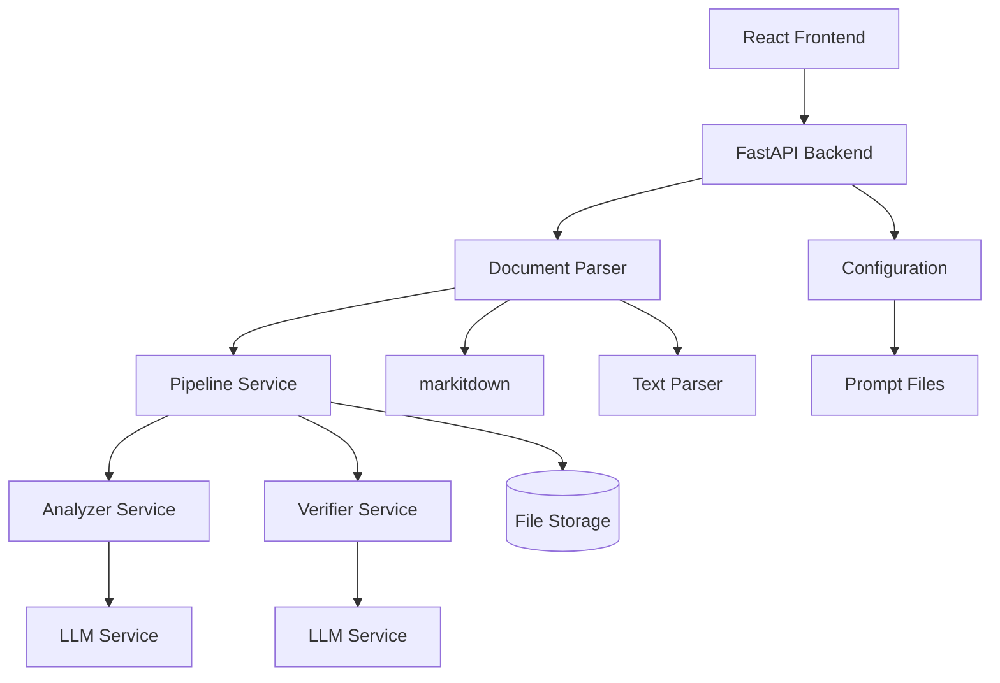
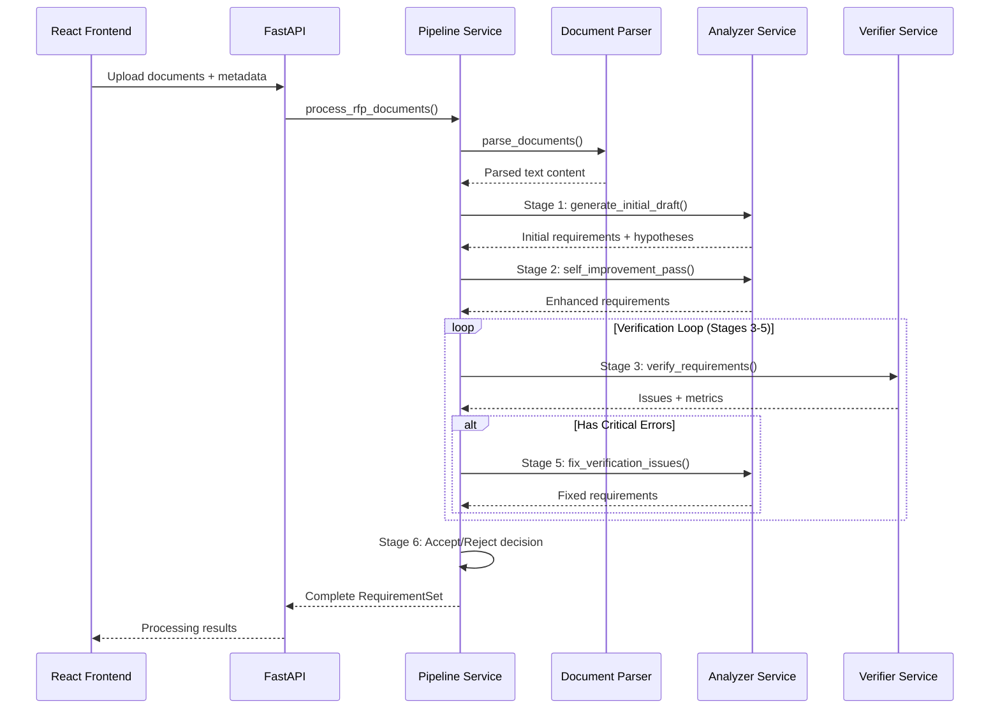
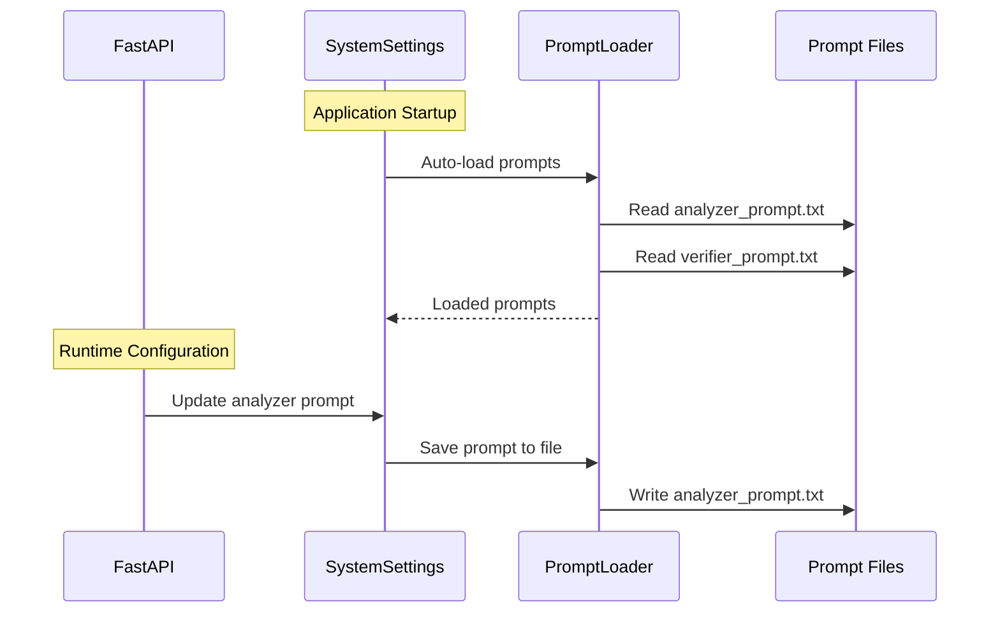

# System Architecture

Comprehensive architectural documentation for the RFP Business Requirements Extractor.

## Overview

The RFP Business Requirements Extractor is a sophisticated dual-agent system that processes RFP documents, interviews, and related materials to extract accurate business requirements using a 6-stage pipeline inspired by Gemini 2.5 Pro's IMO 2025 approach.

## High-Level Architecture



## Component Architecture

### 1. Presentation Layer

#### React Frontend (`frontend/`)
- **Purpose**: User interface for document upload and results visualization
- **Technology**: React 18, TypeScript, Tailwind CSS
- **Key Components**:
  - `HomePage`: Main application interface
  - `FileUploader`: Multi-format file upload with validation
  - `ResultsDisplay`: Interactive results visualization
- **API Communication**: Axios-based service layer with proxy to backend

**File Structure**:
```
frontend/
├── src/
│   ├── components/        # Reusable UI components
│   ├── pages/            # Page-level components
│   ├── services/         # API communication layer
│   ├── types/            # TypeScript type definitions
│   └── App.tsx           # Main application component
├── public/               # Static assets
└── package.json          # Dependencies and scripts
```

### 2. API Layer

#### FastAPI Backend (`solver_verifier/api/`)
- **Purpose**: RESTful API for document processing and configuration
- **Technology**: FastAPI, Uvicorn
- **Key Features**:
  - Multipart file upload handling
  - Request validation with Pydantic
  - Static file serving for React frontend
  - Comprehensive error handling

**Endpoints**:
- Document processing: `/pipeline/process`
- Configuration management: `/pipeline/configure/*`
- Status monitoring: `/pipeline/status/{set_id}`
- System information: `/pipeline/stages`

### 3. Business Logic Layer

#### Pipeline Service (`solver_verifier/services/pipeline_service.py`)
- **Purpose**: Orchestrates the complete 6-stage pipeline
- **Responsibilities**:
  - Document parsing coordination
  - Stage progression management
  - Iteration control and acceptance criteria
  - Error handling and recovery

**Pipeline Flow**:
```
Input Documents → Stage 1: Initial Draft → Stage 2: Self-Improvement 
                     ↓
Stage 6: Accept/Reject ← Stage 5: Bug Fixes ← Stages 3-4: Verification Loop
```

#### Analyzer Service (`solver_verifier/services/analyzer_service.py`)
- **Purpose**: Equivalent to "Solver" in Gemini's approach
- **Responsibilities**:
  - Initial requirement extraction (Stage 1)
  - Self-improvement and refinement (Stage 2)
  - Issue resolution based on verifier feedback (Stage 5)
- **Key Features**:
  - Direct citation extraction with location tracking
  - Atomic requirement decomposition
  - Hypothesis separation from confirmed requirements

#### Verifier Service (`solver_verifier/services/verifier_service.py`)
- **Purpose**: Equivalent to "Verifier" in Gemini's approach
- **Responsibilities**:
  - Requirement validation against source documents (Stage 3)
  - Bug report generation with categorized issues
  - Quality metrics calculation
- **Validation Checks**:
  - Traceability: Citation accuracy and location verification
  - Semantic consistency: Requirement alignment with source context
  - Atomicity: Single-responsibility principle adherence
  - Schema compliance: Required field validation

#### Document Parser Service (`solver_verifier/services/document_parser.py`)
- **Purpose**: Multi-format document text extraction
- **Supported Formats**:
  - PDF: via markitdown library
  - Markdown: direct parsing with encoding detection
  - Text: direct parsing with UTF-8/CP949 support
  - Office documents: DOCX, PPTX, XLSX via markitdown
- **Features**:
  - Asynchronous processing
  - Error handling with detailed messages
  - Metadata extraction

### 4. Data Layer

#### Data Models (`solver_verifier/models/`)

**Business Requirement Schema**:
```python
class BusinessRequirement(BaseModel):
    br_id: str                          # Unique identifier
    title: str                          # Brief requirement title
    description: str                    # Detailed description
    requirement_type: RequirementType  # Functional/non-functional/etc.
    priority: Priority                  # Critical/high/medium/low
    citations: List[Citation]           # Source document references
    stakeholders: List[str]             # Involved parties
    acceptance_criteria: List[AcceptanceCriteria]  # Testable criteria
    # ... additional metadata fields
```

**Citation Schema**:
```python
class Citation(BaseModel):
    text: str                           # Exact quoted text
    location: SourceLocation            # Document location info
    context: Optional[str]              # Surrounding context
```

**Verification Issue Schema**:
```python
class VerificationIssue(BaseModel):
    issue_id: str                       # Unique identifier
    br_id: str                          # Related requirement ID
    error_type: ErrorType               # Critical error vs justification gap
    severity: str                       # High/medium/low
    description: str                    # Issue description
    suggested_fix: Optional[str]        # Recommended resolution
```

### 5. Configuration Layer

#### Settings Management (`solver_verifier/models/agent_config.py`)
- **Purpose**: Centralized configuration with auto-loading
- **Features**:
  - Environment variable support
  - File-based prompt loading from `prompts/`
  - Pipeline parameter configuration
  - Runtime prompt updates via API

**Configuration Sources** (in priority order):
1. Environment variables (`.env` file)
2. File-based prompts (`prompts/*.txt`)
3. Runtime API updates
4. Default values

#### Prompt Management (`solver_verifier/services/prompt_loader.py`)
- **Purpose**: System prompt loading and persistence
- **Features**:
  - Comment filtering for clean prompts
  - UTF-8 encoding support
  - Auto-loading at startup
  - API-based runtime updates

## Data Flow

### Document Processing Flow



### Configuration Flow



## Design Patterns

### 1. Service Layer Pattern
- Clear separation between API, business logic, and data layers
- Dependency injection through constructor parameters
- Async/await throughout for non-blocking operations

### 2. Pipeline Pattern
- Sequential stage execution with iteration support
- Configurable acceptance criteria and retry logic
- State preservation between stages

### 3. Strategy Pattern
- Document parser selection based on file format
- Configurable system prompts for different agent behaviors
- Pluggable verification strategies

### 4. Observer Pattern (Implicit)
- Progress tracking through pipeline stages
- Status updates for long-running operations
- Error reporting with detailed context

## Scalability Considerations

### Current Architecture
- Single-process FastAPI application
- Synchronous pipeline execution
- In-memory state management
- Local file storage

### Future Scalability Options
- **Horizontal Scaling**: Multiple FastAPI instances behind load balancer
- **Asynchronous Processing**: Celery/Redis for background document processing
- **Database Integration**: PostgreSQL for persistent storage
- **Caching Layer**: Redis for intermediate results and session state
- **Message Queuing**: RabbitMQ/Apache Kafka for pipeline stage communication

## Security Considerations

### Current Security Measures
- File type validation on upload
- Temporary file cleanup after processing
- No permanent file storage
- Input sanitization through Pydantic models

### Security Recommendations
- **File Size Limits**: Implement per-file and total upload limits
- **Content Scanning**: Malware detection for uploaded files
- **Rate Limiting**: Request rate limiting to prevent abuse
- **Authentication**: User authentication and authorization
- **Input Validation**: Enhanced validation for all user inputs
- **Audit Logging**: Comprehensive logging for security monitoring

## Performance Characteristics

### Current Performance
- **File Upload**: ~1-5MB/sec depending on file type
- **Document Parsing**: ~10-100 pages/sec (varies by format)
- **Pipeline Processing**: ~30-300 seconds per document set
- **Memory Usage**: ~100-500MB per processing session

### Optimization Opportunities
- **Parallel Processing**: Multi-document parallel parsing
- **Caching**: LLM response caching for similar content
- **Streaming**: Streaming responses for large result sets
- **Background Processing**: Asynchronous pipeline execution

## Deployment Architecture

### Development Deployment
```
Local Machine
├── React Dev Server (localhost:3000)
│   └── Proxy → FastAPI (localhost:8000)
├── FastAPI Server (localhost:8000)
│   ├── Static file serving (built React)
│   └── API endpoints (/pipeline/*)
└── File System
    ├── prompts/ (configuration)
    ├── temp files (processing)
    └── logs/ (application logs)
```

### Production Deployment Options

#### Option 1: Single Server
```
Server
├── Nginx (Port 80/443)
│   ├── Static files (React build)
│   └── Reverse proxy → FastAPI
├── FastAPI (Gunicorn/Uvicorn)
├── File Storage (mounted volume)
└── Monitoring (logs, metrics)
```

#### Option 2: Container Deployment
```
Docker Compose
├── nginx-container
├── fastapi-container
├── redis-container (optional)
└── postgres-container (optional)
```

## Monitoring and Observability

### Current Monitoring
- Basic health check endpoint (`/health`)
- Pipeline stage tracking
- Error logging with stack traces

### Recommended Monitoring
- **Application Metrics**: Request counts, response times, error rates
- **Pipeline Metrics**: Success rates, processing times, quality scores
- **System Metrics**: CPU, memory, disk usage
- **Log Aggregation**: Centralized logging with search/alerting
- **Distributed Tracing**: Request tracing across components

## Testing Strategy

### Current Testing
- Basic API endpoint testing
- Model validation testing
- File parsing testing

### Comprehensive Testing Plan
- **Unit Tests**: Individual service and model testing
- **Integration Tests**: Full pipeline testing with sample documents
- **API Tests**: Complete API endpoint validation
- **Frontend Tests**: React component and integration testing
- **Performance Tests**: Load testing with various document types
- **Security Tests**: Input validation and vulnerability scanning