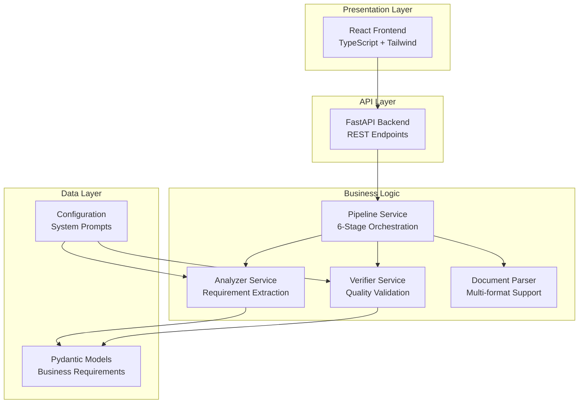

# Documentation Index

Comprehensive documentation for the RFP Business Requirements Extractor.

## Quick Links

| Document | Description | Audience |
|----------|-------------|----------|
| [User Guide](USER_GUIDE.md) | Complete user manual | End Users, Business Analysts |
| [API Reference](API_REFERENCE.md) | REST API documentation | Developers, Integrators |
| [Development Guide](DEVELOPMENT.md) | Development setup and workflows | Developers |
| [Architecture Guide](ARCHITECTURE.md) | System design and architecture | Architects, Senior Developers |

## Overview

The RFP Business Requirements Extractor is a sophisticated AI-powered system that processes RFP documents, interviews, and related materials to extract accurate business requirements. The system uses a dual-agent architecture inspired by Gemini 2.5 Pro's IMO 2025 approach, implementing a 6-stage Analyzer-Verifier pipeline for maximum accuracy and traceability.

## Key Features

🎯 **Dual-Agent Architecture**: Analyzer extracts requirements, Verifier validates accuracy  
📄 **Multi-Format Support**: PDF, Markdown, Text, DOCX, PPTX, XLSX  
🔍 **6-Stage Pipeline**: Complete extraction to acceptance workflow  
🎨 **React Frontend**: Intuitive web interface  
📊 **Quality Metrics**: Comprehensive accuracy and coverage metrics  
🔧 **Configurable**: Customizable system prompts and pipeline behavior  

## Getting Started

### Quick Start
```bash
# Install dependencies
uv sync
cd frontend && npm install && cd ..

# Build frontend
./scripts/build-frontend.sh

# Start server
uv run uvicorn main:app --reload

# Visit http://localhost:8000
```

### Basic Usage
1. Upload RFP documents (PDF, Word, Markdown, etc.)
2. Enter project name and description
3. Click "Analyze Requirements"
4. Review extracted requirements and quality metrics

## System Architecture



## 6-Stage Pipeline

1. **Initial BR Draft**: Extract requirements with citations
2. **Self-improvement**: Refine and enhance the draft
3. **Verification**: Validate against source documents
4. **Review (Optional)**: Human/AI review of results
5. **Bug Fixes**: Address verification issues
6. **Accept/Reject**: Final quality decision

## Quality Metrics

The system provides comprehensive quality assessment:

- **Recall**: Coverage of source requirements (target: >85%)
- **Precision**: Accuracy of extracted requirements (target: >90%)
- **Traceability**: Citation completeness (target: >85%)
- **Misinterpretation Rate**: Incorrect interpretations (target: <5%)

## Document Formats

| Format | Parser | Use Case |
|--------|--------|----------|
| PDF | markitdown | RFP documents, formal specifications |
| Markdown | Direct | Technical documentation, structured notes |
| Text | Direct | Meeting notes, interview transcripts |
| DOCX/PPTX/XLSX | markitdown | Office documents, presentations, data |

## Configuration

### System Prompts
- **Auto-loading**: Prompts load from `prompts/` directory at startup
- **API Configuration**: Update prompts via REST endpoints
- **Environment Variables**: Override via `.env` file

### Pipeline Settings
- **Max Iterations**: 1-10 verification cycles (default: 5)
- **Acceptance Threshold**: Consecutive passes needed (default: 3)
- **Stage 4 Review**: Optional human review (default: disabled)

## API Endpoints

| Endpoint | Method | Description |
|----------|--------|-------------|
| `/pipeline/process` | POST | Process RFP documents |
| `/pipeline/status/{id}` | GET | Check processing status |
| `/pipeline/configure` | GET/POST | System configuration |
| `/pipeline/stages` | GET | Pipeline information |
| `/health` | GET | Health check |

## Development

### Technology Stack
- **Backend**: Python 3.10+, FastAPI, Pydantic, uv
- **Frontend**: React 18, TypeScript, Tailwind CSS
- **Document Processing**: markitdown, async I/O
- **Deployment**: Docker, Uvicorn/Gunicorn

### Development Workflow
1. Set up environment with uv and npm
2. Configure system prompts in `prompts/` directory
3. Run backend with `uv run uvicorn main:app --reload`
4. Run frontend with `npm start` (development) or build with script
5. Test with sample RFP documents

### Testing
- **Unit Tests**: `uv run pytest`
- **Integration Tests**: Full pipeline testing
- **Frontend Tests**: `npm test`
- **API Tests**: REST endpoint validation

## Deployment Options

### Single Server
- FastAPI + built React frontend
- Nginx reverse proxy (optional)
- Local file storage

### Container Deployment
- Docker Compose setup
- Multi-container architecture
- Volume mounts for configuration

### Cloud Deployment
- Horizontal scaling support
- External storage integration
- Load balancer compatibility

## Documentation Structure

```
docs/
├── README.md           # This index file
├── USER_GUIDE.md       # Complete user manual
├── API_REFERENCE.md    # REST API documentation
├── DEVELOPMENT.md      # Development setup and workflows
└── ARCHITECTURE.md     # System design and architecture
```

## Contributing

1. **Setup**: Follow Development Guide for environment setup
2. **Changes**: Create feature branch, implement with tests
3. **Documentation**: Update relevant documentation files
4. **Testing**: Run full test suite before submitting
5. **Review**: Submit pull request with clear description

## Support and Resources

### Self-Service
- Check system health at `/health`
- Review configuration at `/pipeline/configure`
- Examine quality metrics in results
- Test with smaller, cleaner documents

### Common Issues
- **File Format Errors**: Check supported formats list
- **Processing Timeouts**: Large documents may take 5+ minutes
- **Poor Quality Results**: Review document structure and clarity
- **Configuration Issues**: Verify prompt loading and pipeline settings

### Performance Guidelines
- **File Size**: Keep individual files under 100MB
- **Document Quality**: Well-structured documents yield better results
- **Processing Time**: Expect 1-5 minutes per document set
- **Concurrent Users**: System supports multiple simultaneous analyses

## License and Usage

This system is designed for business requirement analysis and should be used in compliance with organizational policies and data protection requirements. Ensure sensitive information is handled appropriately according to your security guidelines.

## Version History

- **v0.1.0**: Initial release with 6-stage pipeline
- **React Frontend**: Web interface for document upload and results
- **Multi-format Support**: PDF, Markdown, Office documents
- **Quality Metrics**: Comprehensive accuracy and coverage tracking